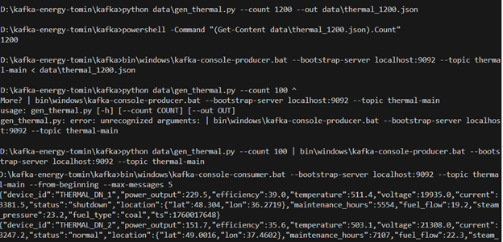
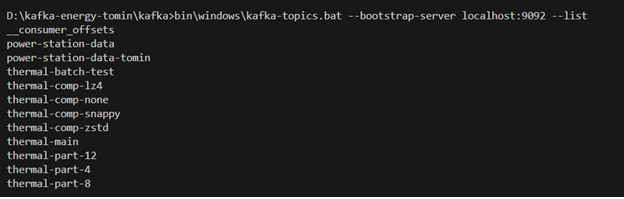
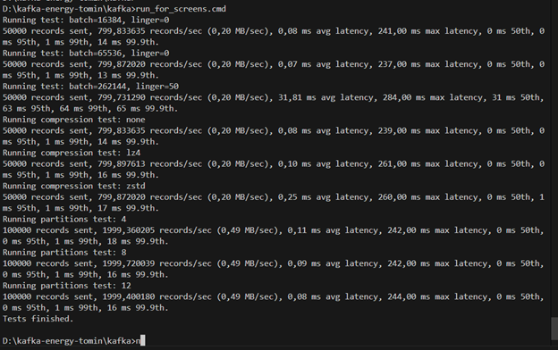
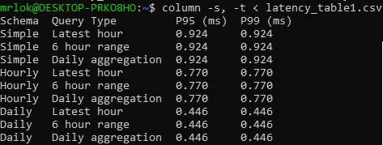
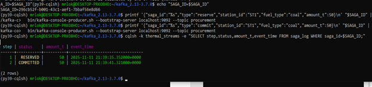

НАЦІОНАЛЬНИЙ ТЕХНІЧНИЙ УНІВЕРСИТЕТ УКРАЇНИ  
"КИЇВСЬКИЙ ПОЛІТЕХНІЧНИЙ ІНСТИТУТ ІМЕНІ ІГОРЯ СІКОРСЬКОГО”  
НАВЧАЛЬНО-НАУКОВИХ ІНСТИТУТ АТОМНОЇ ТА ТЕПЛОВОЇ ЕНЕРГЕТИКИ  
КАФЕДРА ЦИФРОВИХ ТЕХНОЛОГІЙ В ЕНЕРГЕТИЦІ  

ЛАБОРАТОРНА РОБОТА №4 
 з дисципліни "Проектування систем з розподіленими базами даних в енергетиці"  
ТЕМА: "Потокова обробка енергетичних даних з транзакційною семантикою в Apache Kafka Streams"  
ВАРІАНТ: 6 ПІДВАРІАНТ Б 

Виконав: студент групи ТР-52мп 
Томін Владислав Вікторович 
 Перевірив: Волков О. В.

---
 **МЕТА РОБОТИ**

Розробити систему потокової обробки енергетичних даних з використанням Apache Kafka Streams, що забезпечує транзакційну семантику exactly-once та інтеграцію з Apache Cassandra для збереження результатів обробки.

---
**ОПИС ВАРІАНТУ**

Об'єкт дослідження
•	Кількість: 8 ТЕС, 32 енергоблоки 
•	Частота: Кожні 15 секунд 
•	Throughput: ~2.1 msg/sec 
•	Дані: power_output, fuel_consumption, steam_pressure, steam_temperature, flue_gas_temp, NOx_emissions, SOx_emissions, CO2_emissions. 

Підваріант Б: Hopping Windows (30 хв / 10 хв крок) + Saga Pattern 
Завдання: 
1.	Ковзні вікна для оптимізації fuel mix між блоками 
2.	Розрахунок heat rate та економічного диспетчування 
3.	State з історією для прогнозування витрат палива 
4.	2-крокова Saga для fuel procurement: 
•	Крок 1: Резервування палива 
•	Крок 2: Оновлення інвентаризації 
1.	Compensation при скасуванні закупівлі 
2.	Saga log для фінансового обліку 
Cassandra таблиці: 
•	fuel_optimization_aggregates 
•	fuel_inventory 
•	saga_log 

---
**ХІД РОБОТИ**

•  fuel_optimization_aggregates — таблиця з готовими 30-хвилинними підсумками по станції/блоку/типу палива (середні значення й рахунок точок). Звідси швидко будуємо графіки й робимо диспетчування. 
•  fuel_inventory — «історія складу»: на часовій шкалі зберігаємо, скільки палива доступно і скільки вже в резерві. Дає поточний стан і зміни з часом. 
•  saga_log — журнал процесу закупівлі: що сталося з конкретною операцією (резервування, підтвердження або відміна) і коли. Потрібно для контролю й аудиту. 

  

**Потокова реалізація**

**Генератор телеметрії (telemetry_gen.py)**

Це «датчик-емулятор»: він раз на ~0.47 с (≈2.1 повідомлення/с) шле у Kafka-топік thermal.telemetry короткі JSON-повідомлення про стан блоків. У кожному повідомленні ми вказуємо, з якої станції і блоку прийшли дані (station_id, block_id), коли саме (ts у мілісекундах), що міряли (наприклад, fuel_flow, steam_pressure, steam_temperature, flue_gas_temp) і який fuel_type (coal/gas/mixed). Це просто імітація реального потоку від 32 блоків 8 ТЕС.

**Віконний агрегатор (stream_windows.py)**

Цей процес слухає той самий топік і «склеює» сирі точки в короткі підсумки за часом. Ми беремо ковзні вікна по 30 хв із кроком 10 хв (тобто один запис може потрапити одразу у 3 перекривні вікна). 
    Для кожної комбінації
(station_id, block_id, fuel_type, window_start) він рахує середні значення (avg_fuel_flow, avg_steam_pressure), кількість точок (records) і просту метрику ефективності heat_rate (співвідношення «пальне/тиск» з коефіцієнтом). Коли вікно закривається (після window_end з невеликим запасом часу), один акуратний рядок із цими підсумками записується в таблицю fuel_optimization_aggregates.
Ідея проста: замість мільйонів сирих подій ми маємо готові 30-хвилинні «цеглинки» для графіків і диспетчерських рішень.

**Сага-воркер (saga_worker.py)
**
Це окремий процес для бізнес-операції «закупівля/резерв палива». Він слухає Kafka-топік procurement і реагує на три типи подій: 
•	reserve — спробувати зарезервувати певну кількість (amount_t) для station_id та fuel_type;  
•	commit — підтвердити операцію (списати з наявного); 
•	cancel — відкотити резерв. 

Поточний стан складу ми ведемо у таблиці fuel_inventory як часовий ряд: кожна зміна — це новий рядок із міткою часу ts, оновленими available_t (скільки є) і reserved_t (скільки вже в резерві).
Результат кожного кроку ми прозоро фіксуємо у журналі saga_log: там зберігаємо ідентифікатор операції saga_id, номер кроку step (1 — резерв, 2 — коміт, −1 — компенсація), status (наприклад, RESERVED, COMMITTED, COMPENSATED), а також хто і що робив (station_id, fuel_type, amount_t, event_time). Це дає і контроль, і аудит.

Результати на виході
•	Оперативні підсумки для оптимізації палива: у fuel_optimization_aggregates за 30-хв вікнами видно середні витрати/тиски й умовний heat_rate по кожному блоку й типу палива — зручно для трендів і порівнянь. 
•	Прозорий облік палива: у fuel_inventory можна миттєво побачити «скільки доступно» та «скільки в резерві» і як це змінювалось у часі.  
•	Керована транзакція закупівлі: saga_log показує шлях кожної операції — чи вдалося зарезервувати, чи підтвердили, чи довелося відкотити — з точним часом і обсягами. 
Коротко: генератор дає живі дані, агрегатор перетворює їх на корисні 30-хв підсумки, а сага-воркер надійно веде процеси закупівлі та обліку палива. 

 
 
Демонстрація роботи пайплайна: дані генеруються, агрегуються за ковзними вікнами і зберігаються в Cassandra. 
  

Ковзні вікна з кроком 10 хв формуються коректно, а агрегати по ним розраховуються і доступні для аналітики точковими запитами.  
 

У цьому фрагменті показано запуск транзакції типу Saga: згенеровано унікальний ID операції, у Kafka послідовно надіслано події “reserve” та “commit”, після чого виконано запит до журналу. У логах за цим ID відображаються дві стадії однієї операції на 50 т: спочатку успішне резервування, далі успішне підтвердження з часовими мітками. Це демонструє коректну обробку подій воркером і фіксацію перебігу транзакції.  
 

---

**ВИСНОВКИ**

 У роботі реалізовано повний цикл потокової обробки: від генерації телеметрії до агрегування у ковзних вікнах і запису результатів у Cassandra, а також транзакційний шаблон Saga для керування закупівлями палива з історією інвентаризації та журналом кроків. Отримані структури даних забезпечують швидкі запити для онлайн-моніторингу й оперативного диспетчування (через показник heat_rate), а Saga дає контрольованість і відновлюваність бізнес-процесів.
