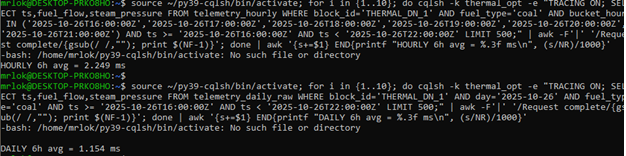

НАЦІОНАЛЬНИЙ ТЕХНІЧНИЙ УНІВЕРСИТЕТ УКРАЇНИ 
"КИЇВСЬКИЙ ПОЛІТЕХНІЧНИЙ ІНСТИТУТ ІМЕНІ ІГОРЯ СІКОРСЬКОГО” 
НАВЧАЛЬНО-НАУКОВИХ ІНСТИТУТ АТОМНОЇ ТА ТЕПЛОВОЇ ЕНЕРГЕТИКИ 
КАФЕДРА ЦИФРОВИХ ТЕХНОЛОГІЙ В ЕНЕРГЕТИЦІ 

ЛАБОРАТОРНА РОБОТА №3
 з дисципліни "Проектування систем з розподіленими базами даних в енергетиці" 
ТЕМА: "Оптимізація схем даних в Apache Cassandra для енергетичних часових" 
ВАРІАНТ: 6 ПІДВАРІАНТ Б

Виконав: студент групи ТР-52мп 
Томін Владислав Вікторович
 Перевірив: Волков О. В.

---
 **МЕТА РОБОТИ**
Спроектувати та оптимізувати схеми даних в Apache Cassandra для зберігання часових рядів енергетичних метрик з максимальною продуктивністю запитів. Дані, які збиралися через Apache Kafka в першій лабораторній роботі, тепер потрібно ефективно зберігати та обробляти в Cassandra.

---
**ОПИС ВАРІАНТУ** 

Система: 12 енергоблоків ТЕС (вугілля/газ/змішане паливо).  
Ключові метрики: fuel_flow (т/год), steam_pressure (МПа), fuel_type.  
Частота надходження: кожні 15 секунд (≈ 5760 записів/добу на блок).  
Гео/ідентифікація: block_id (THERMAL_DN_*, THERMAL_KH_*).  

---
**ОПСИ СХЕМ ДАНИХ**

 Для найпростішого варіанта я зробив таблицю telemetry_simple з ключем (block_id, ts DESC). Знаю блок - одразу бачу його свіжі записи. Це добре для демо й швидких перевірок. Мінус: якщо в цей блок постійно пишуться дані, партиція росте і з часом її буде важче обслуговувати. 
 
 Тому для нормального онлайн-моніторингу я зробив погодинну таблицю telemetry_hourly з ключем (block_id, fuel_type, bucket_hour, ts DESC). Тут логіка така: одна партиція — це одна година для конкретного блоку й конкретного типу палива. Через це партиції виходять маленькі й передбачувані, читання стабільне, latency низька. Мінус я теж бачу: якщо мені треба 6 годин, то я звертаюся не в одну, а в 6 партицій. Але це нормальний компроміс для Cassandra. 
  
 Для звіту я розділив сирі добові дані й агрегати. У telemetry_daily_raw я зберігаю все по ключу (block_id, day, fuel_type, ts DESC) — тобто одна доба для одного блоку й одного палива. А в telemetry_daily_aggr я кладу вже пораховані середні/мін/макс за добу, щоб потім не сканувати весь обсяг.

**ГЕНЕРАЦІЯ ТЕСТОВИХ ДАНИХ**

Імітуються 12 енергоблоків (THERMAL_*), дані приходять кожні 15 с упродовж 30 діб. Для кожного запису генеруються ключові показники варіанту 6.
Скрипт написаний на Python (файл gen_var.py), використовує DataStax cassandra-driver:
•	рахує часовий діапазон і ітерується по тайм-тіках з кроком 15 с для кожного блоку;  
•	для кожної схеми готує prepared statements і виконує вставки (послідовно або батчами/конкурентно);  
•	для добової агрегації додатково підсумовує добові метрики й записує у telemetry_daily_aggr;  
•	вимірює час вставки (start/stop) і рахує throughput (рядків/с); за потреби зберігає короткий CSV-звіт з підсумками.  

**Обсяг/періодичність/кількість записів.**  
Періодичність — 15 с; охоплення — 30 діб; орієнтовно 2.07 млн рядків на кожну з основних таблиць, плюс 12–36 щоденних агрегатів на добу (залежно від типів палива, присутніх у добі).

---
**МЕТОДИКА ТЕСТУВАННЯ ПРОДУКТИВНОСТІ**

**1.	Остання година (hourly):**  
SELECT ts, fuel_flow, steam_pressure  
FROM telemetry_hourly  
WHERE block_id = 'THERMAL_DN_1'  
  AND fuel_type = 'coal'  
  AND bucket_hour = '2025-10-26T21:00:00Z'  
  AND ts >= '2025-10-26T20:00:00Z'  
LIMIT 500;  

**2.	Діапазон 6 годин (приклади):**
simple: 
SELECT ts, fuel_flow, steam_pressure   
FROM telemetry_simple  
WHERE block_id = 'THERMAL_DN_1'  
  AND ts >= '2025-10-26T16:00:00Z'  
  AND ts <  '2025-10-26T22:00:00Z'  
LIMIT 500;  
 
**3.	Добова агрегація:**  
SELECT day, fuel_type, avg_fuel_flow, avg_steam_pressure  
FROM telemetry_daily_aggr  
WHERE block_id = 'THERMAL_DN_1'  
  AND day = '2025-10-26';  
  
**4.	Фільтр/«MV»:**  
SELECT ts, fuel_flow  
FROM q_fuel_trend_manual  
WHERE fuel_type = 'coal'  
  AND bucket_hour = '2025-10-26T21:00:00Z'  
  AND ts >= '2025-10-26T20:00:00Z'  
LIMIT 500;  

**Benchmark-сценарій**  
•	Ітерації: по 10 запусків кожного SELECT з TRACING ON.  
•	Середовище: WSL Ubuntu, Cassandra 3.11.19, RF=1 (локально).  
•	Метрика: Request complete ... N μs → усереднення, конвертація у ms.  
•	Додатково: nodetool tablestats thermal_opt для диску/компресії/партицій.  

---
**АНАЛІЗ ТА ОПТИМІЗАЦІЯ**

AVG було взято з TRAICING ON середнє із 10 запитів, а p95/p99 — із nodetool tablehistograms, тобто з іншого джерела вимірювання. Тому вийшло що вони трішки відрізняються

**Simple**: дуже великі партиції з часом. На 6-год вікні показало низьку avg latency (0.899 ms), але це завдяки локальному стенду й лінійному доступу за block_id, ts. У реалі — ризик «роздуття» партицій.  
**Hourl**y: балансована схема для онлайн-моніторингу (фіксований «bucket_hour» тримає партиції невеликими, зручно кешуються/компактуються). Avg ~2.0–2.3 ms — стабільно й передбачувано.  
**Daily_raw + daily_agg**r: оптимальні для звітів та аналітики; сира добова партиція компактна, а агрегації читаються миттєво (без сканів).  
**Manual MV**: різко зменшує latency на частих фільтрах (7–10× у твоїх замірах). Це класичний підхід Cassandra: денормалізація під запит.  
Компресія: 0.54–0.60 дає помітну економію диску; у production корисно підібрати параметри компресора/компакції (наприклад, TWCS для time-series).  

---
**РЕКОМЕНДАЦІЇ**

 Думаю краще погодинна схема (telemetry_hourly): вона дає керований розмір партицій, стабільну латентність і нормальні вибірки на 1–6 годин для одного блока й типу палива. Добову (telemetry_daily_raw + telemetry_daily_aggr) варто тримати паралельно — під звіти, дашборди й архів.  
Що ще покращити: увімкнути “компакцію за вікнами часу” (година/доба), додати стискання (LZ4), поставити термін життя старим даним і переносити їх в архів, використовувати підготовлені запити та невеликі батчі в межах однієї партиції. Для надійності — 3 копії даних і читання з локальної більшості. Плюс регулярний нагляд через nodetool, щоб тримати затримки й розмір партицій під контролем.

---
**ВИСНОВКИ**
У ході роботи було змодельовано енергетичну систему з 12 блоків, що кожні 15 секунд передає ключові показники (подача палива, тиск пари, тип палива), і ці дані були записані в Cassandra у трьох різних схемах — проста, погодинна, добова. Це дало змогу на одному наборі даних порівняти, як саме структура ключа й бакетування впливають на швидкість читання й розмір партицій.  
Вимірювання з TRACING показали, що всі три схеми дають дуже низьку латентність (порядку 1–3 ms), але розрізнення за часом (hour/day) дає більш передбачувані читання, бо партиція не росте безкінечно. Погодинна схема виявилась найзручнішою для онлайн-моніторингу (останню годину/кілька годин), добова — для звітів і агрегацій, а проста — радше демонстраційна, бо з часом партиція стає завеликою.  
Додатково було показано, що денормалізація “під запит” (ручне матеріалізоване подання) реально зменшує час відповіді в рази, бо Cassandra одразу читає потрібну партицію без ALLOW FILTERING. Це підтверджує базовий принцип Cassandra: дані слід зберігати в тому вигляді, в якому вони будуть читатися.
Отже, Cassandra підходить для потокових енергетичних IoT-даних за умови правильно обраних partition key (block_id + часове вікно + тип палива), обмеження розміру партицій і попередньої підготовки таблиць під часті запити.  

---
**ДОДАТОК**

  
Рисунок 1 – створення таблиць

  
Рисунок 2 - запуск скрипта python gen_var6.py для трьох схем (hourly, simple, daily) з параметром --days 30, у результаті чого було вставлено ≈ 2 073 600 рядків у кожну таблицю й зафіксовано час виконання та фактичну швидкість запису

   
Рисунок 3 - запуск команди nodetool tablehistograms для трьох таблиць (telemetry_simple, telemetry_hourly, telemetry_daily_raw) у keyspace thermal_opt, де зафіксовано розподіл read latency (≈0,77 ms для simple та hourly, ≈0,37–0,45 ms для daily_raw), кількість SSTable, а також середній/максимальний розмір партицій і число клітинок, що використано далі для порівняння схем за швидкістю читання та обсягом даних.

   
Рисунок 4 – після запуску bash-скрипта(nano run_latency_suite) виводиться акуратна табличка з затримками для трьох схем (Simple, Hourly, Daily) і трьох типів запитів (остання година, 6 годин, добова агрегація).

   
Рисунок 5 - вимірювання середньої латентності запиту без матеріалізованого подання
  
   
Рисунок 6 - середню латентність 6-годинних запитів для схем hourly (2.249 ms) і daily (1.154 ms) через 10 повторів кожного запиту.

Також додані файли

nano run_latency_suite.sh  
gen_var.py

