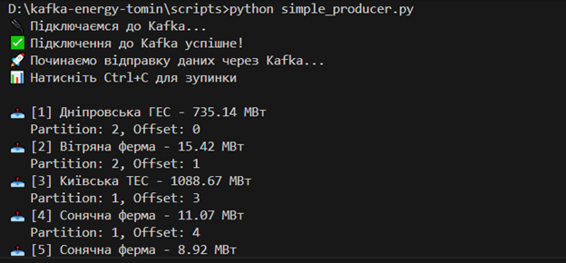
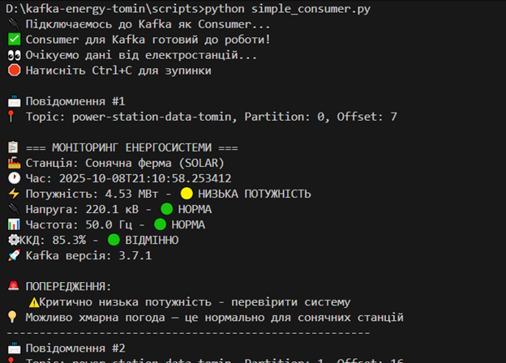

# Практична робота №1  
**Дисципліна:** Проектування систем з розподіленими базами даних в енергетиці  

## Виконав
- **Студент:** Томін Владислав Вікторович
- **Група:** ТР-52мп
- **Викладач:** Волков О.В.  

---

## Тема роботи
**Основи роботи з Apache Kafka у розподілених базах даних**
## Мета роботи
 - Ознайомитися з архітектурою Apache Kafka та її роллю в обробці потокових даних.
 - Навчитися створювати топіки, продюсерів і конс’юмерів.
 - Відпрацювати передачу повідомлень у розподіленому середовищі.
 - Начитись створювати прості приклади роботи з Kafka.

---

## Зміст роботи
1. Завантаження та встановлення Kafka.
2. Створення топіка.  
3. Реалізація **продюсера** для відправки повідомлень.  
4. Реалізація **консьюмера** для прийому повідомлень.  
5. Демонстрація обміну даними.  

---

## Результати

---

## Висновки
Отримано практичні навички роботи з Apache Kafka — запуск брокера, створення топіків, реалізація продюсера й консюмера на Python, а також проведення тестів продуктивності. Система успішно реалізує модель потокової обробки даних, де продюсер надсилає інформацію в реальному часі, а консюмер її аналізує та відображає. Kafka продемонструвала високу стабільність, масштабованість і швидкодію, що робить її ефективним рішенням для побудови систем моніторингу, телеметрії та аналітики в енергетичних і промислових застосуваннях.
