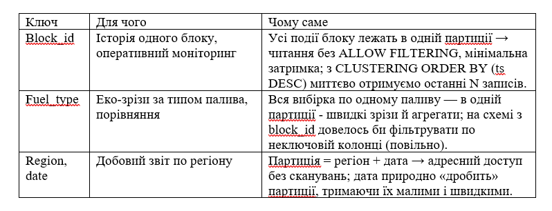

НАЦІОНАЛЬНИЙ ТЕХНІЧНИЙ УНІВЕРСИТЕТ УКРАЇНИ 
"КИЇВСЬКИЙ ПОЛІТЕХНІЧНИЙ ІНСТИТУТ ІМЕНІ ІГОРЯ СІКОРСЬКОГО” 
НАВЧАЛЬНО-НАУКОВИХ ІНСТИТУТ АТОМНОЇ ТА ТЕПЛОВОЇ ЕНЕРГЕТИКИ 
КАФЕДРА ЦИФРОВИХ ТЕХНОЛОГІЙ В ЕНЕРГЕТИЦІ 

ЛАБОРАТОРНА РОБОТА №2
 з дисципліни "Основи Cassandra: створення першої енергетичної системи моніторингу" 
ТЕМА: "Дослідження продуктивності Apache Kafka для енергетичних IoTпотоків" 
ВАРІАНТ: 6 ПІДВАРІАНТ Б

Виконав: студент групи ТР-52мп 
Томін Владислав Вікторович
 Перевірив: Волков О. В.

 **МЕТА РОБОТИ**
 
Освоїти принципи проєктування розподілених схем даних у Apache Cassandraна прикладі енергетичних систем моніторингу. Навчитися створювати keyspace, таблиці з різними типами ключів, наповнювати їх тестовими даними, виконувати базові запити та аналізувати ефективність різних схем зберігання.
 
 **ЗАВДАННЯ РОБОТИ**
 
Створити keyspace і таблиці для: котлів, турбін, викидів, екологічних зведень. 
Порівняти варіанти ключів: block_id, fuel_type, (region, date). 
Написати скрипт на Python для порівняння двох об’єктів (середня потужність). 
Зробити короткий аналіз і висновки щодо придатності Cassandra для енергетичних IoT-систем.

**ОПИС ЗАВДАННЯ ЗА ВАРІАНТОМ**

Система: 12 енергоблоків ТЕС (вугілля/газ), Східна Україна.
Потік даних: ~кожні 10 с, ключові параметри: тиск, температура, витрата палива, потужність, оберти, викиди CO₂/NOx/SO₂
Порівнювані схеми доступу:
1.	Історія конкретного блоку → ключ block_id.
2.	Еко-моніторинг за паливом → ключ fuel_type.
3.	Добовий звіт за регіоном → ключ (region, date).

**ХІД РОБОТИ**

**1.	Keyspace**

 
 
**2.	Створення таблиць**

 

**3.	Внесення даних в таблицю та їх відображення**

 
 
**4.	Python скрипт** порівняння підключається до Cassandra, читає з таблиці turbines_by_block останні значення потужності (power_mw) для двох вибраних блоків (змінні BLOCK_A, BLOCK_B, за замовчуванням до 50 рядків), рахує середню потужність для кожного і друкує коротке порівняння та висновок
 
 

**Порівняння ключів доступу**

•	Історія блока (block_id) - цей ключ дозволяє миттєво отримати всі події одного блоку — читається одна партиція, швидко й без фільтрацій.
Використовуємо для оперативного моніторингу та розслідування інцидентів.
•	Еко-зріз за паливом (fuel_type) - дає зріз «усі coal / усі gas» одним запитом, бо вся добірка по типу палива лежить разом.
Зручно порівнювати викиди й ефективність між паливами без повільного ALLOW FILTERING.
•	Денний звіт за регіоном (region, date) - партиція створюється на комбінацію регіон+дата, тому денний звіт дістається адресно й дешево.
Ідеально для щоденної екозвітності та підсумкової аналітики по областях.

**ВІДПОВІДІ НА КОНТРОЛЬНІ ПИТАННЯ**

1.	Partition vs Clustering key:
Partition key визначає, в якій партиції зберігаються рядки (маршрутизація по кластеру).
Clustering key задає порядок всередині партиції та формує діапазонні запити (час/діапазон).
2.	Чому денормалізація:
Cassandra оптимізована під швидкі читання за ключем. Під кожен сценарій доступу створюють окрему таблицю, щоб уникати повільних сканів/ALLOW FILTERING.
3.	Ключ для часових рядів:
Партиційний ключ — ідентифікатор об’єкта (напр., block_id), clustering — час (ts) з CLUSTERING ORDER BY (ts DESC). За потреби — «бакетизація» по даті/годині, щоб партиції не розростались.
4.	Реплікаційний фактор (RF):
Скільки копій кожного партиційного фрагмента зберігається в кластері. Більший RF → вища відмовостійкість і доступність, але більше диску/реплікаційного трафіку.
5.	Навіщо CLUSTERING ORDER BY (timestamp DESC):
Щоб останні події отримувати без сортування і читати мінімум сторінок — критично для моніторингу.
6.	Як зрозуміти, що партиція занадто велика:
Повільні читання, високі затримки, nodetool tablestats показує великі Partitions/Mean/Max; потрібно розбивати (наприклад, додати date до партиційного ключа).
7.	Переваги Cassandra для потокових енергетичних даних:
Горизонтальна масштабованість, висока швидкість запису, лінійне масштабування, гнучкі схеми під сценарії доступу, прості TTL і time-series патерни.

**ВИСНОВКИ**

Cassandra підходить для енергетичних IoT-систем завдяки швидкому запису, читанню за ключем і горизонтальній масштабованості. Денормалізація під сценарії (block_id, fuel_type, (region, date)) дозволяє отримувати потрібні зрізи без повільних фільтрацій. Для телеметрії з частими вставками й доступом “останні N подій” структура з CLUSTERING ORDER BY (ts DESC) забезпечує низьку латентність та предиктивну продуктивність.

